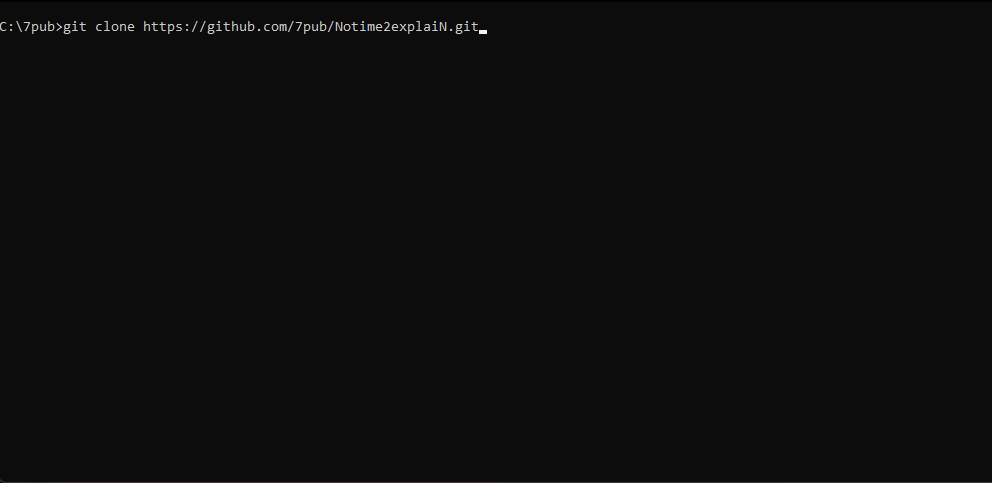

<section align="right">

[](https://github.com/7pub/)
[](https://hamzamohdzubair.github.io/redant/)
[](https://docs.rs/crate/redant/latest)
[](https://crates.io/crates/redant)
[](https://lib.rs/crates/redant)

</section>

<section align="right">

[](https://7pub.github.io/timeroll/app/)

</section>


<p align = "right">
  <a href="https://7pub.github.io/timeroll/app/">
</p>

<hr/>

https://img.shields.io/badge/Open-Webapp-blue

---

## Install

`git clone https://7pub.github.io/notime2explain.git`

`cd notime2explain`

`npm i gulp@4.0.0 --save-dev`

`yarn`

`npm run serve`




---

## 📄 License

| DO WHAT THE FUCK YOU WANT TO PUBLIC LICENSE |

---

| MACHEN DAMIT WAS VERDAMMT NOCHMAL DU AUCH IMMER MIT DIESER ÖFFENTLICHE LIZENZ MACHEN WILST |

| | Version.02  |
|- | -|
| Copyright (C) 2019 Karl Achleitner theorem.system@protonmail.com | |
  > Weitere Informationen finden Sie unter [http://unlicense.org](http://unlicense.org)

---

<center>

````

                   ,,:cc$$$$$$$$$$$Cccc
               ,,c$$$$$$$$$$$$$$$$$$$$$Cc
             ,c$$$$$$$$$$$$$$$$$$$$$$$$$$ßc
          ,c$$$$$$$$$$$$$$$$$$$$$$$$$$$$$$$ßc
        ,d$$$$$$$$$$$$$$$$$$$$$$$$$$$$$$$$$$ßc
       ,$$$$$$$d$$$$$$$$$$$$$$$$$$$$$$$$$$$$$Cc
      ,$$$$$$$$$$$$$$$$$$$$$$$$$$$$$$$$$$$$$$$$ß
      J$$$$$$$$$$$$$$$$$$$$$$$$$$$$$$$$$$$$$$$$$;
      $$$$$$$$$$$$$$$$$$$$$$$$$$$$$$$$$$$$$$$$$$;
      $$$$$$$$$$$$$$$$$$$$$$$$$$$$$$$$$d$$$$$$$;
      `$$$$$$$$`nnn'$$$$$$$$$$$$$$$",d$ $$$$$$;
        `$$$$$$$ MMMM`$$$$$$$$$$$$F,MMMb`$$$$$$
         `$$$$$$ MTTM.?$$$$$$$$$$$,MMMMM $$$$$;
          `$$$$$$     `$$$$$$$$$$$,      $$$$$$
            ?$$$$$,( `) $$$$$$$$$$ ,;`)  $$$$$;
              ?$$$$,(&) $$$$$$$$$$ (&; ) $$$$$;
               `$$$$.`-; $$$$$$$$$$,`--;,$$$$;
              $$$$$hh$$$$$????$$$hc$$$$$$$$$$;
              $$$$$$$$$$$$ `======; $$$$$$$$$$;
              `$$$$$$$$$$$$$c,,,,c$$$$$$$$$$$;
               "*$$$$P"" "$$$$$$?????$$??"
          Oh my goodness... $$$$$ 
                            $$$$$\
                          ,$$$$$$$\
                         $$$$$$$$$$$
                        $$$$$$$$$$$$$
                        $$$$$$$$$$$$$$
                        $$$$$$$$$$$$$$$
                        $$$$$$$$$$$$$$$
                         $$$$$$$$$$$$$$
                         `$$$$$$$$$$F
                          `CCC´ `CC$
                           CCC   CCC
     ,;CCCC;,,             CCC   CCCC
    CCCCCCCCCCCCCCCCCCCCCCCCCC   `CCCCCCCCCCCCC.,,,,,;CCCC;,,
    CCCCCCCCCCCCCCCCCCCCCCCC/     `CCCCCCCCCCCCCCCCCCCCCCCCCC
     CCCCCCCCCCCCCCCCCCCCCC;       `CCCCCCCCCCCCCCCCCCCCCCCCc
      *CCC<a href="http://7pub.github.io/RESTful/"></a>cCCC°
```

</center>

----
